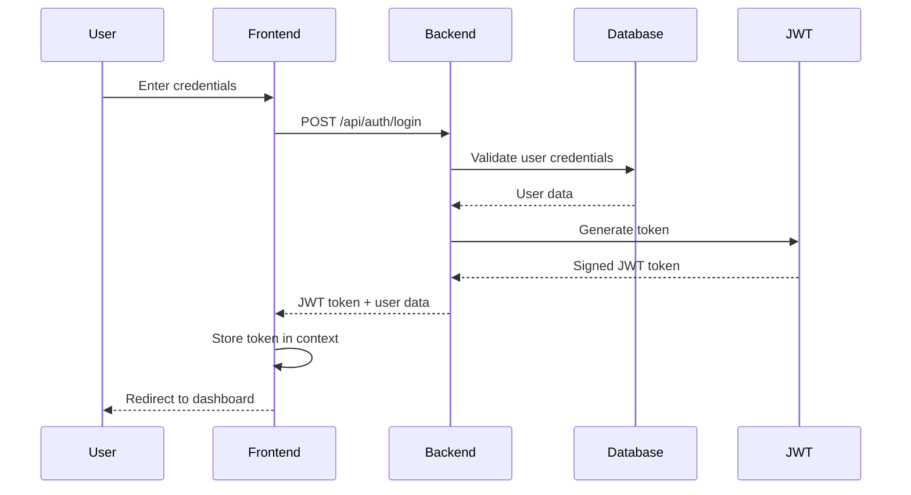
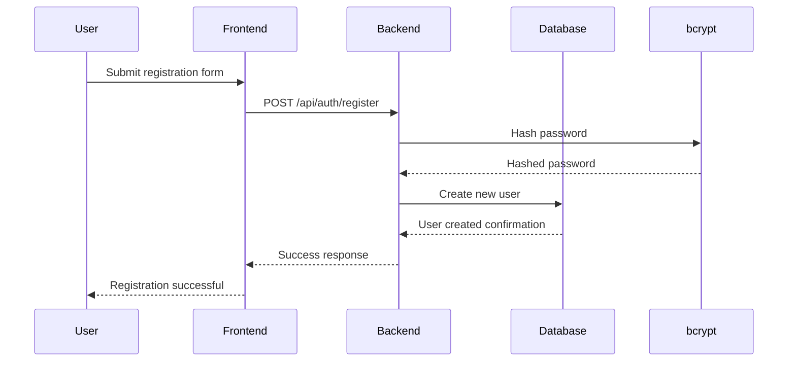
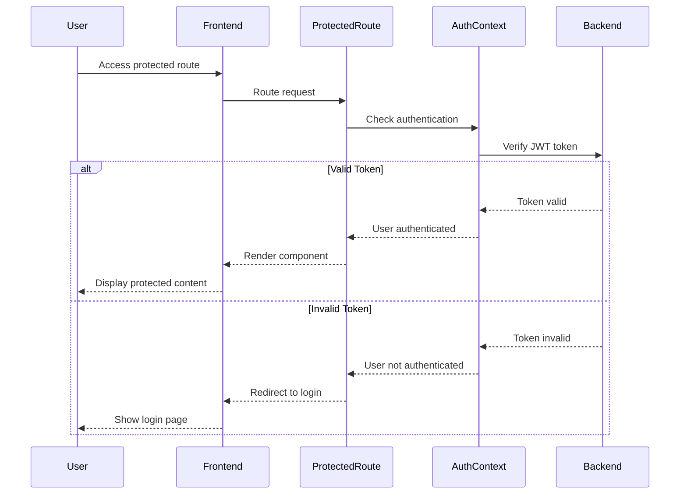

# 🔐 Full Stack Authentication Project

This is a comprehensive full-stack authentication system that provides secure user management with JWT-based authentication. The project features a robust backend API built with Node.js and Express, connected to MongoDB for data persistence, and a modern React frontend styled with Tailwind CSS.

## 🚀 Features

- **Secure Authentication**: JWT-based authentication with bcrypt password hashing
- **User Registration & Login**: Complete user onboarding flow
- **Protected Routes**: Route-level access control for authenticated users
- **User Dashboard**: Comprehensive user profile management interface
- **Password Management**: Secure password update functionality
- **Account Management**: Self-service account deletion
- **Session Management**: Secure logout with token invalidation
- **Responsive Design**: Mobile-first UI built with Tailwind CSS

## 🛠 Tech Stack

### Backend


- **Node.js** - JavaScript runtime environment
- **Express.js** - Web application framework
- **MongoDB** - NoSQL database
- **Mongoose** - MongoDB object modeling
- **JWT (jsonwebtoken)** - Token-based authentication
- **bcrypt** - Password hashing library
- **cors** - Cross-origin resource sharing
- **dotenv** - Environment variable management

### Frontend


- **React** - User interface library
- **React Router** - Client-side routing
- **Tailwind CSS** - Utility-first CSS framework
- **Axios** - HTTP client library

## 📋 Prerequisites

Before running this project, make sure you have the following installed:
- Node.js (v14 or higher)
- npm or yarn package manager
- MongoDB (local installation or MongoDB Atlas account)

## ⚙️ Installation & Setup

### Backend Setup

**1. Clone the repository**
```bash
git clone <repository-url>
cd <repository-directory>/backend
```

**2. Install backend dependencies**
```bash
npm install
```

**3. Environment configuration**

Create a `.env` file in the `backend` directory:
```env
MONGO_URI=mongodb://localhost:27017/auth-app
JWT_SECRET=your-super-secret-jwt-key-here
PORT=5000
NODE_ENV=development
```

**4. Start the backend server**
```bash
npm start
```
Server will be running on `http://localhost:5000`

### Frontend Setup

**1. Navigate to frontend directory**
```bash
cd ../frontend
```

**2. Install frontend dependencies**
```bash
npm install
```

**3. Environment configuration**

Create a `.env` file in the `frontend` directory:
```env
REACT_APP_API_URL=http://localhost:5000
```

**4. Start the development server**
```bash
npm start
```
Application will be running on `http://localhost:3000`

## 📁 Project Structure

### Backend Architecture
```
backend/
├── server.js                 # Application entry point & server configuration
├── config/
│   └── db.js                 # MongoDB connection setup
├── middleware/
│   └── jwtAuthMiddleware.js  # JWT authentication middleware
├── models/
│   └── User.js               # User schema & model definition
├── routes/
│   └── auth.js               # Authentication route definitions
├── controllers/
│   └── authController.js     # Business logic for authentication
├── package.json              # Backend dependencies & scripts
└── .env                      # Environment variables
```

### Frontend Architecture
```
frontend/
├── public/
│   └── index.html            # HTML template
├── src/
│   ├── components/           # React components
│   │   ├── Home.jsx          # Landing page component
│   │   ├── Login.jsx         # User login form
│   │   ├── Register.jsx      # User registration form
│   │   ├── Dashboard.jsx     # User dashboard & profile
│   │   └── ProtectedRoute.jsx # Route protection wrapper
│   ├── context/
│   │   └── AuthContext.jsx   # Global authentication state
│   ├── services/
│   │   └── api.js            # API service layer
│   ├── App.jsx               # Main application component
│   ├── index.js              # React application entry point
│   └── index.css             # Global styles & Tailwind imports
├── package.json              # Frontend dependencies & scripts
└── .env                      # Environment variables
```

## 🔄 System Architecture

### Authentication Flow Diagram



### Registration Flow Diagram



### Protected Route Access



## 🎯 API Endpoints

### Authentication Routes

| Method | Endpoint | Description | Authentication |
|--------|----------|-------------|----------------|
| POST | `/api/auth/register` | User registration | None |
| POST | `/api/auth/login` | User login | None |
| GET | `/api/auth/profile` | Get user profile | Required |
| PUT | `/api/auth/update-password` | Update password | Required |
| DELETE | `/api/auth/delete-account` | Delete user account | Required |

### Request/Response Examples

**Registration Request:**
```json
{
  "name": "John Doe",
  "email": "john@example.com",
  "password": "securePassword123"
}
```

**Login Response:**
```json
{
  "success": true,
  "token": "eyJhbGciOiJIUzI1NiIsInR5cCI6IkpXVCJ9...",
  "user": {
    "id": "60d5ecb74b24a0001f5e4e8b",
    "name": "John Doe",
    "email": "john@example.com"
  }
}
```

## 🎨 User Interface

### Component Overview

- **Home**: Landing page with navigation to login/register
- **Register**: User registration form with validation
- **Login**: Authentication form with error handling
- **Dashboard**: User profile management interface
- **ProtectedRoute**: Higher-order component for route protection

### Styling Features

- Responsive design with Tailwind CSS
- Modern UI components with hover effects
- Form validation feedback
- Loading states and error messages
- Mobile-first approach

## 🔐 Security Features

### Backend Security
- **Password Hashing**: bcrypt with salt rounds
- **JWT Authentication**: Stateless token-based auth
- **CORS Configuration**: Cross-origin request handling
- **Input Validation**: Server-side validation
- **Environment Variables**: Sensitive data protection

### Frontend Security
- **Token Storage**: Secure context-based state management
- **Route Protection**: Authenticated route access only
- **API Error Handling**: Graceful error management
- **Form Validation**: Client-side input validation

## 📚 Usage Guide

### Getting Started

**1. Register a New Account**
- Navigate to `/register`
- Fill in your name, email, and password
- Submit the form to create your account

**2. Login to Your Account**
- Go to `/login`
- Enter your registered email and password
- Successfully authenticate to access the dashboard

**3. Access Your Dashboard**
- After login, you'll be redirected to `/dashboard`
- View your profile information
- Update your password
- Delete your account if needed

**4. Logout Securely**
- Click the logout button from any authenticated page
- Your session will be terminated and you'll be redirected to home

### Protected Routes

The application implements route-level protection to ensure only authenticated users can access sensitive pages:

- `/dashboard` - Requires valid JWT token
- Any route wrapped with `ProtectedRoute` component
- Automatic redirect to login page for unauthenticated access attempts

## 🧪 Testing

### Manual Testing Checklist

- [ ] User registration with valid data
- [ ] User registration with invalid/duplicate data
- [ ] User login with correct credentials
- [ ] User login with incorrect credentials
- [ ] Dashboard access when authenticated
- [ ] Dashboard redirect when not authenticated
- [ ] Password update functionality
- [ ] Account deletion functionality
- [ ] Logout functionality
- [ ] Token expiration handling

## 🚀 Deployment

### Backend Deployment
1. Set up MongoDB Atlas or production MongoDB instance
2. Configure production environment variables
3. Deploy to platforms like Heroku, Railway, or DigitalOcean
4. Update CORS settings for production frontend URL

### Frontend Deployment
1. Update `REACT_APP_API_URL` to production backend URL
2. Build the production bundle: `npm run build`
3. Deploy to platforms like Netlify, Vercel, or AWS S3
4. Configure routing for single-page application

## 🤝 Contributing

1. Fork the repository
2. Create a feature branch: `git checkout -b feature/new-feature`
3. Commit your changes: `git commit -m 'Add new feature'`
4. Push to the branch: `git push origin feature/new-feature`
5. Open a pull request

## 📄 License

This project is licensed under the MIT License - see the LICENSE file for details.

## 🐛 Troubleshooting

### Common Issues

**MongoDB Connection Error**
- Ensure MongoDB is running locally or check Atlas connection string
- Verify network access and firewall settings

**JWT Token Issues**
- Check JWT_SECRET in environment variables
- Verify token expiration settings

**CORS Errors**
- Ensure backend CORS is configured for frontend URL
- Check for correct API endpoint URLs

**Build Errors**
- Clear node_modules and reinstall dependencies
- Check for version compatibility issues

## 📞 Support

For support and questions:
- Create an issue in the GitHub repository
- Check existing documentation and troubleshooting guide
- Review the codebase for implementation details

---

**Built with ❤️ using Node.js, React, and MongoDB**
